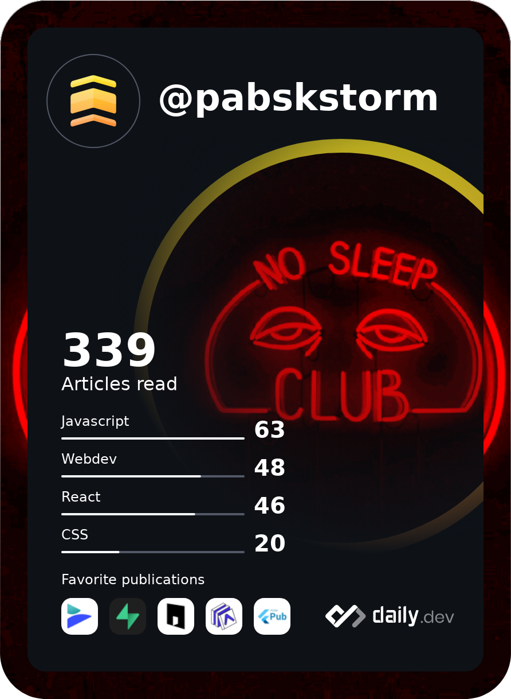

    

    
    

  

        
        
        
        
        
        

    
    
    
    
    
    

    
    
    

    
    
    

<h3>
- How to find me -
</h3>

    
    
    
    
    
    

  

    

