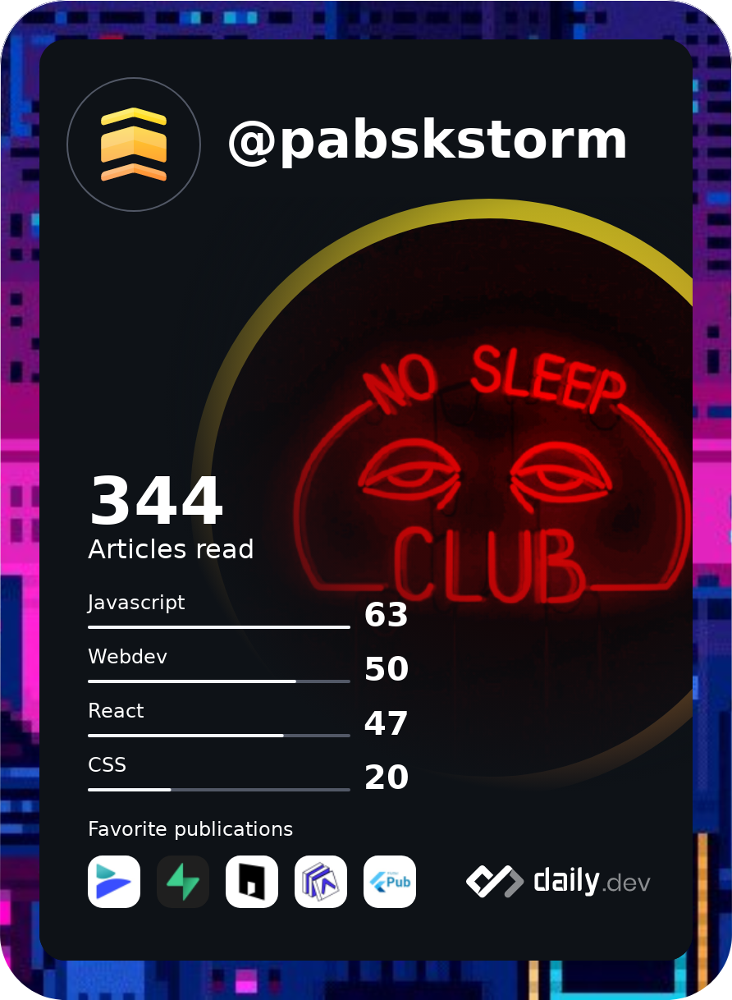

    

    
    

  
<h3>
𝕄𝕪 𝕊𝕜𝕚𝕝𝕝𝕤
</h3>

        
        
        
        
        
        

    
    
    
    
    
    

    
    
    

    
    
    

<h3>
ℍ𝕠𝕨 𝕥𝕠 𝕗𝕚𝕟𝕕 𝕞𝕖
</h3>

    
    
    
    
    
    

<h3>
𝔹𝕒𝕕𝕘𝕖𝕤
</h3>

    

